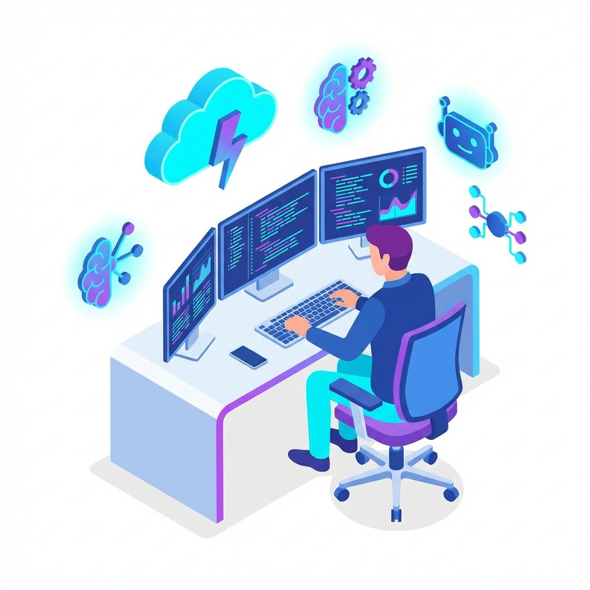
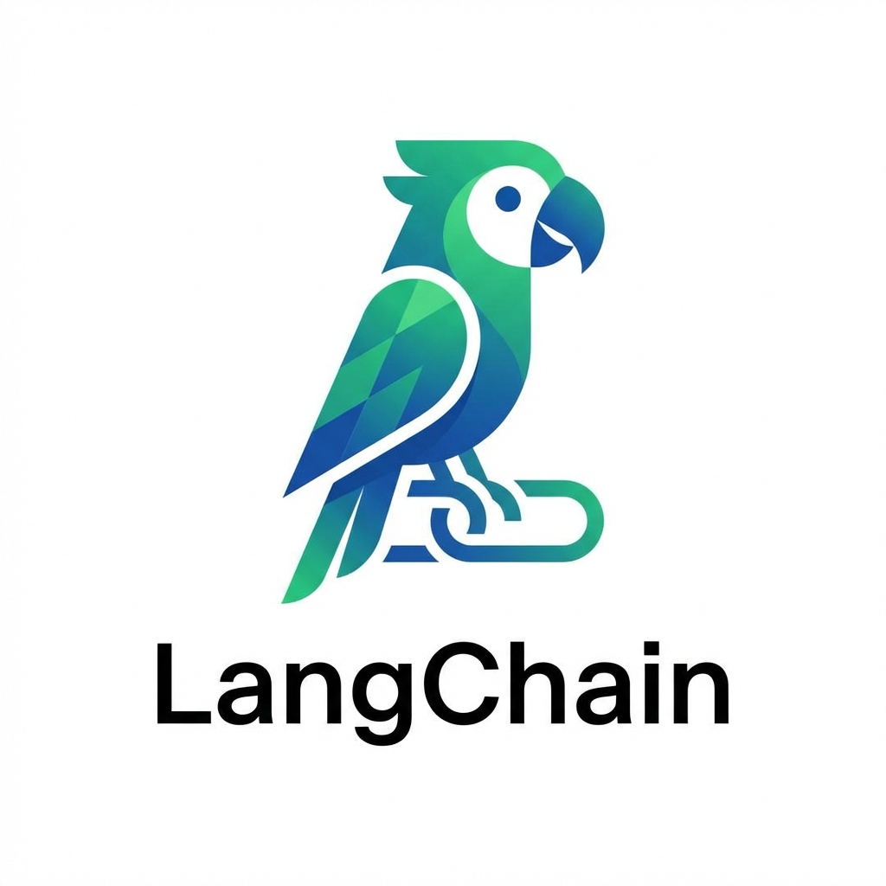
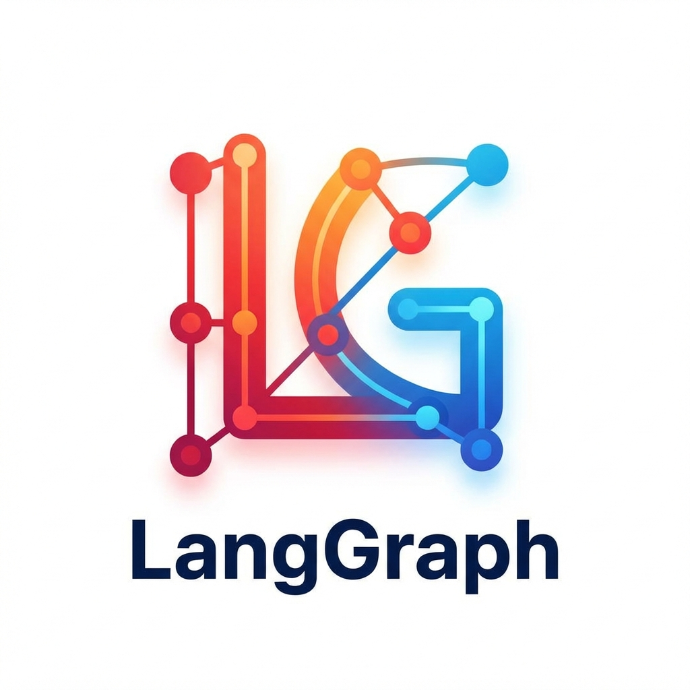
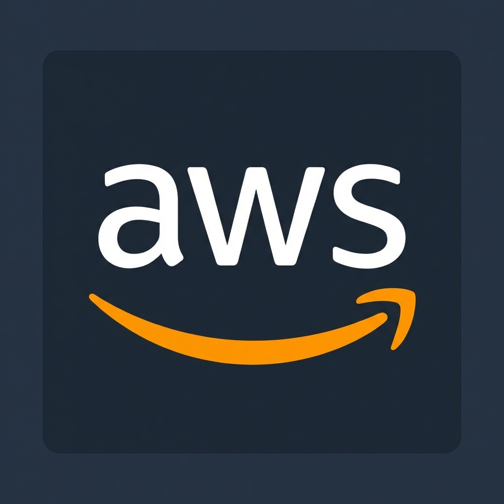
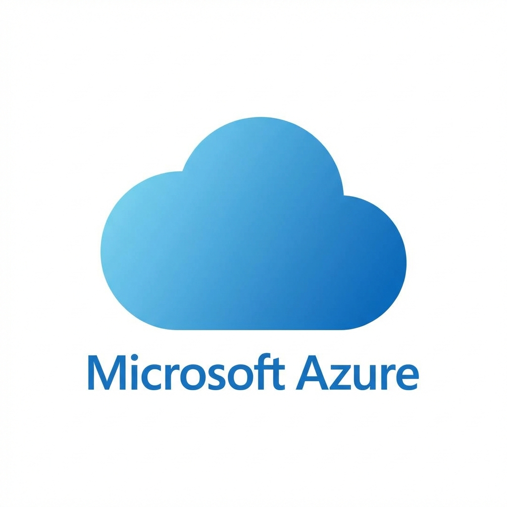
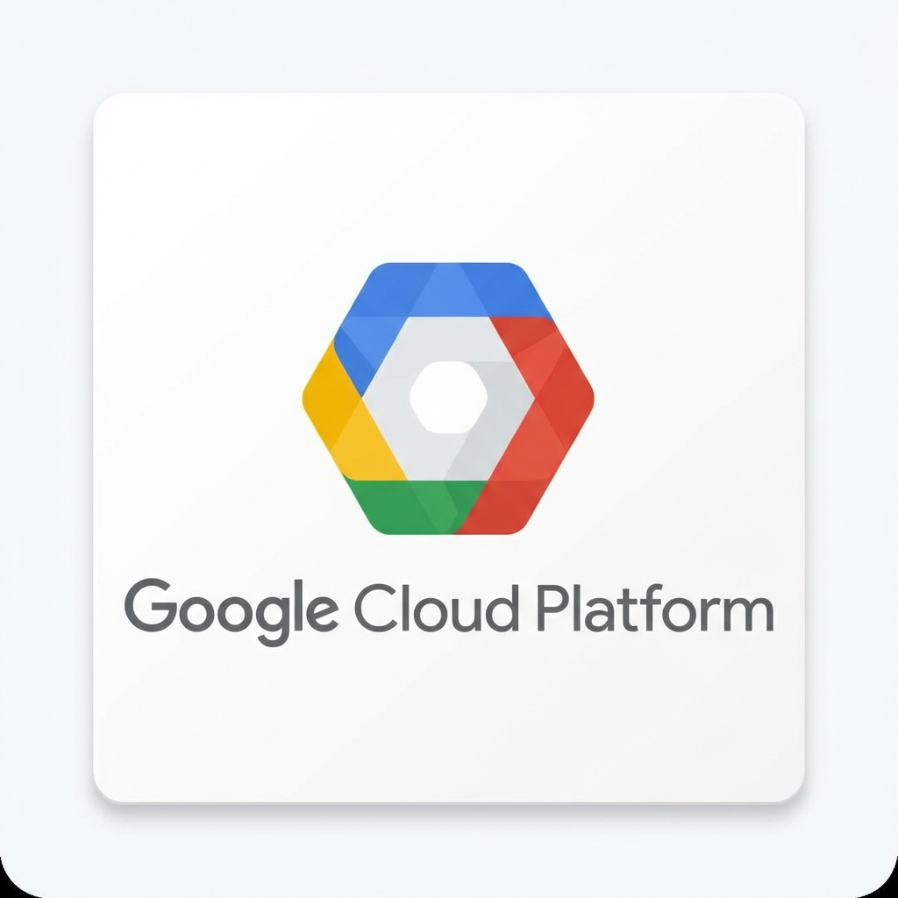
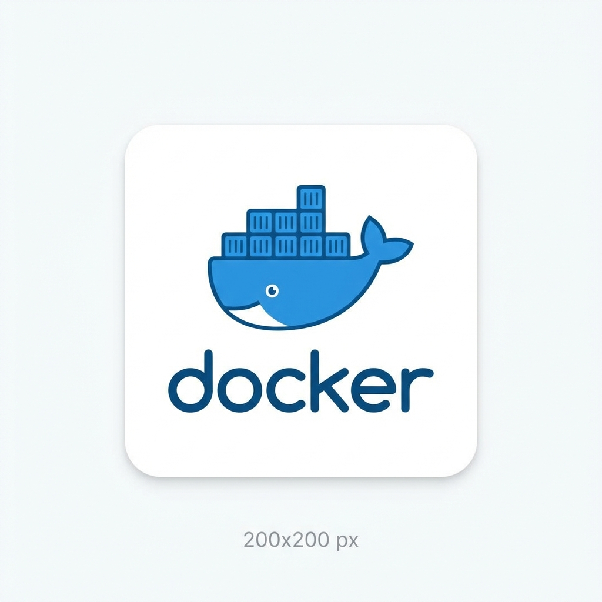
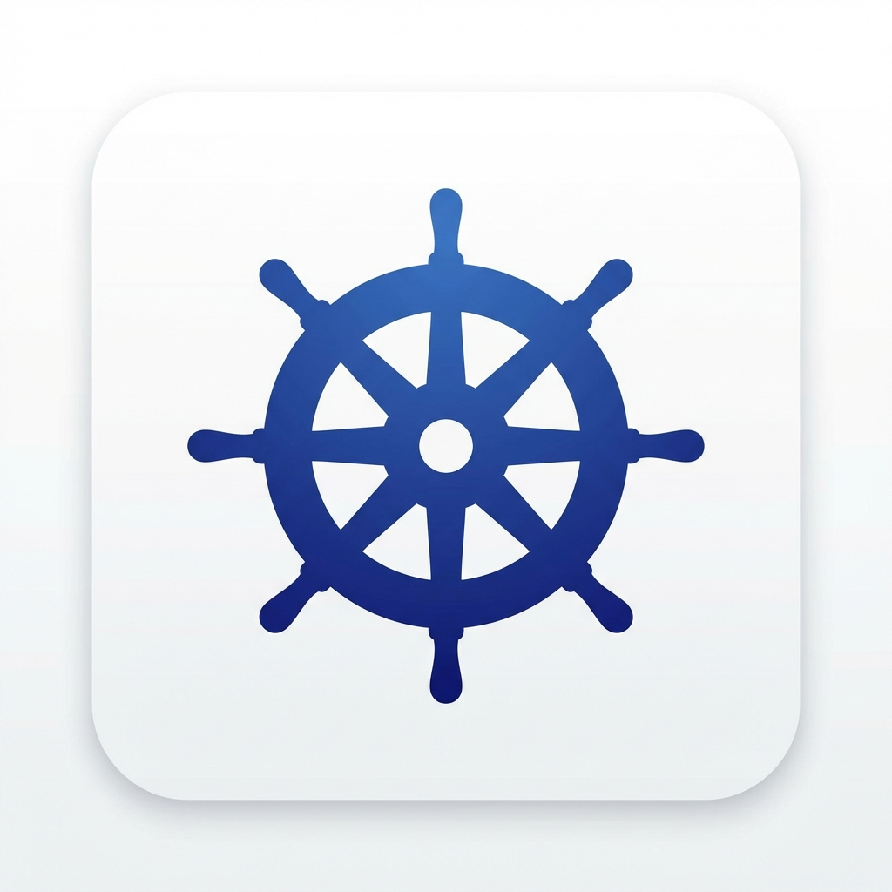
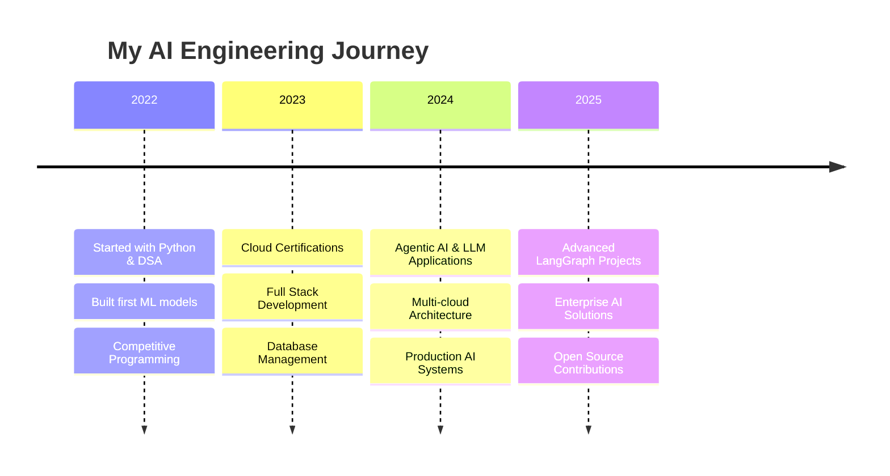

---

## 👨‍💻 About Me

🚀 **AI Engineer** specializing in **Large Language Models** and **Agentic AI**  
☁️ **Multi-Cloud Architect** with expertise across AWS, Azure, and GCP  
🏗️ **Full Stack Developer** building scalable, intelligent systems  
🎯 **Problem Solver** leveraging AI to tackle real-world challenges

**🔭 Current Focus:**

- 🤖 Building production-ready LLM applications
- 🔗 Developing multi-agent AI systems with LangGraph
- ☁️ Architecting cloud-native solutions
- 📚 Contributing to open-source AI projects

**📊 Quick Stats:**

- 💼 Multiple AI/ML Projects Deployed
- 🏆 Active LeetCode Problem Solver
- ⭐ Open Source Contributor
- 🎓 Continuous Learner in AI/ML Domain

 

---

## 🛠️ Technical Expertise

<b>🤖 AI & Machine Learning</b>

 

<b>☁️ Cloud Platforms & DevOps</b>

 

<b>💻 Programming & Development</b>

 

---

## 🚀 Featured Projects

<table>
<tr>
<td width="50%" valign="top">

### 🤖 Multicloud AI Chatbot

**Intelligent conversational AI platform operating across multiple cloud providers**

**🔧 Tech Stack:**

- LangChain & LangGraph
- AWS, Azure, GCP
- Multi-Agent Architecture
- Vector Databases

**✨ Key Features:**

- Advanced agentic AI patterns
- KYC flow automation
- Package booking system
- Multi-cloud deployment

**📊 Impact:**

- Seamless cloud integration
- Scalable architecture
- Production-ready system

</td>
<td width="50%" valign="top">

### 🧠 Agentic AI Solutions

**Enterprise autonomous agent systems for workflow automation**

**🔧 Tech Stack:**

- Python & LangGraph
- RAG Architecture
- Vector Databases
- Cloud Infrastructure

**✨ Key Features:**

- Task automation
- Multi-agent coordination
- Intelligent decision making
- Enterprise integration

**📊 Impact:**

- 80% reduction in manual tasks
- Improved efficiency
- Scalable solutions

</td>
</tr>
</table>

---

## 📊 GitHub Statistics

 

---

## 🎯 Professional Journey

---

## ⚡ Skill Proficiency

| 🎯 Technology                   | 📈 Proficiency              |
| ------------------------------- | --------------------------- |
| **Agentic AI & LLMs**           | `████████████████████░` 95% |
| **LangChain/LangGraph**         | `██████████████████░░` 90%  |
| **Multi-Cloud (AWS/Azure/GCP)** | `█████████████████░░░` 85%  |
| **Python Development**          | `██████████████████░░` 90%  |
| **DSA & Problem Solving**       | `████████████████░░░░` 80%  |
| **Full Stack Development**      | `███████████████░░░░░` 75%  |
| **DevOps & Docker**             | `██████████████░░░░░░` 70%  |

---

## 🎮 Interactive Zone

🏆 <b>GitHub Trophies</b>

 

📈 <b>Contribution Graph</b>

 

---

## 🌱 Currently Learning

- 🔬 Advanced Agentic AI patterns and frameworks
- 🏗️ Multi-cloud architecture optimization
- 🚀 Enterprise-level LLM applications
- 🔄 Distributed systems and microservices
- 🎯 RAG (Retrieval-Augmented Generation) techniques
- 🧪 Production AI/ML deployment strategies

---

## 🤝 Let's Collaborate!

**I'm always open to exciting opportunities!**

💼 **Freelance Projects** | 🚀 **AI/ML Collaborations** | 🤝 **Open Source** | 💡 **Innovative Ideas**

---

## 💬 Ask Me About

`Agentic AI` `LangChain` `LangGraph` `Multi-Cloud Architecture` `LLM Applications`

`RAG Systems` `Vector Databases` `Python` `AWS` `Azure` `GCP` `Docker`

`Kubernetes` `Full Stack Development` `DSA` `Competitive Programming`

---

### 💡 "Building the future, one intelligent system at a time"

**⭐ Star my repositories if you find them useful!**

<!--
SEO Keywords for Profile Discovery:
AI Engineer, LLM Developer, Agentic AI Expert, LangChain Specialist, LangGraph Developer,
Multi-cloud Architect, AWS Azure GCP, Python Developer, Full Stack AI Engineer,
Machine Learning Engineer, Deep Learning, Chatbot Development, RAG Applications,
Vector Databases, Enterprise AI Solutions, Production AI Systems, Cloud Native Applications
-->
